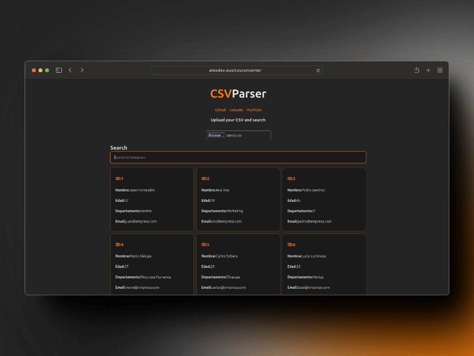

# CSVParser 📙
Aplicación web que permite a los usuarios cargar un archivo CSV con datos preformateados y mostrar esos datos como tarjetas en el sitio web, pudiendo filtrar los datos.
## Desarrollado con 🧰
#### Backend ⚙️
Contiene la lógica de la aplicación y se encarga de gestionar los datos.
- Node.js
- Express
- Typescript
### Frontend 💻
Interfaz de usuario de la aplicación. Dividida en dos partes, upload y search. Donde la lógica que se carga en el cliente esta en `Upload.ts` y `Search.ts`.
- React
- Typescript

## Instrucciones :ins
Al utilizar dos carpetas frontend y backed, se han configurado los worspaces de forma que haciendo:
```bash
npm install
```
en la raíz del proyecto, se instalarán las dependencias de ambos proyectos.

```bash
npm run dev
```
iniciará el servidor de desarrollo tanto del frontend como del backend.

## Links 🔗
- [GitHub](https://github.com/AlexRivasMachin)
- [Portfolio](https://www.linkedin.com/in/alex-rivas-machin/)
- [LinkedIn](https://alexdev.eus/)
